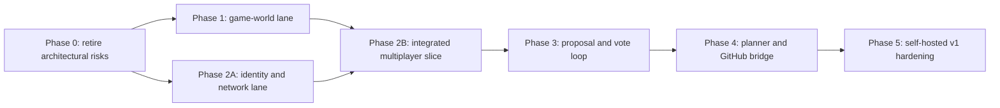

# PLAN.md

Tactical delivery plan for Vibes. Strategic intent and milestone outcomes live in [GOALS.md](./GOALS.md); detailed system decisions live in [docs/](./docs/).

- **Last updated:** July 18, 2026
- **Canonical repository:** `git@github.com:atomantic/vibes.git`
- **Current state:** first local playable foundation; networking and governance are not implemented yet

## Delivery strategy

Vibes will be built as vertical evidence-producing slices, not as a collection of isolated subsystems. The highest-risk assumptions—browser/Node WebRTC interoperability, GPU competition between the game and local inference, authoritative replication, signed unanimity, and duplicate-resistant GitHub recovery—are tested before the project commits to expensive content or infrastructure.

The world lane and platform lane may proceed in parallel after Phase 0, but each phase ends with an integrated playtest and an explicit exit gate.

## Working assumptions

- Desktop web is the first supported client; mobile and XR are not v1 commitments.
- The first instance budget is two to eight trusted players. Higher caps require measured evidence.
- Gameplay uses an elected-authority WebRTC star rather than a full mesh or leaderless simulation.
- `Vibes Node` is the preferred authority and durable host; a foreground browser is a limited fallback.
- A small, replaceable rendezvous service handles authenticated signaling, authority leases, and TURN credentials but not realtime world traffic.
- The proposed definition of “all players” is the deterministic frozen set of trusted, non-spectator avatar controllers in a committed presence snapshot. Phase 0 requires explicit founder confirmation before this becomes the constitution.
- Raw feedback is never sent to a cloud model. Phase 0 selects author-device WebLLM/Ollama or explicitly consented instance-host Ollama as the default using measured quality, privacy, accessibility, security, and game-performance evidence.
- Official instances publish to `atomantic/vibes`; self-hosted forks configure an allowlisted repository and their own GitHub App.
- Accepted proposals file issues only. No model receives code-writing, merge, release, shell, or deployment authority.

## Phase 0 — Foundation and risk retirement

- [x] [planning-foundation] **Planning foundation.** Initialize the canonical repository and capture strategy, architecture, governance, initial-world design, marketing position, phased backlog, and source-backed decisions.
- [x] [license-and-contribution-model] **License and contribution model.** Apply ISC to original repository code, documentation, and procedural content; retain upstream dependency licenses; require explicit compatible source licenses and attribution for future third-party assets and model weights.
- [x] [workspace-and-ci-skeleton] **Workspace and CI skeleton.** Establish a strict TypeScript/pnpm monorepo, formatting, linting, unit tests, browser smoke tests, dependency review, build provenance, and minimal contributor guidance.
- [ ] [renderer-and-physics-spike] **Renderer and physics spike.** Prove direct Three.js rendering, Rapier fixed-step simulation, worker boundaries, chunk coordinates, save/restore, and the visual/performance budget on reference laptops.
  - Local direct-rendering, worker, fixed-step, chunk-coordinate, and application-checkpoint evidence is captured in [docs/IMPLEMENTATION_STATUS.md](./docs/IMPLEMENTATION_STATUS.md). Reference-hardware budgets and cross-platform replay claims remain open, so the parent item stays incomplete.
- [ ] [authority-network-spike] **Authority network spike.** Validate browser-to-`Vibes Node` WebRTC DataChannels across Chrome, Firefox, and Safari; LAN, NAT, CGNAT, IPv6, TURN/UDP, TURN/TLS, reconnect, backpressure, eight-player soak, asymmetric partitions, stale-authority fencing, checkpoint transfer, and application-layer loss/jitter telemetry.
- [ ] [device-identity-and-origin-spike] **Device identity and origin spike.** Prove key creation/storage, enrollment, loss and re-enrollment, official-origin to self-hosted-origin migration, browser-storage clearing, signed ready-session leases, and recovery without treating one device as one human.
- [ ] [vibes-node-packaging-and-loopback-spike] **Vibes Node packaging and loopback spike.** Prove macOS/Windows/Linux native WebRTC loading, signed/notarized packages, install/update/rollback, and an origin-authenticated CSRF-resistant capability-scoped loopback API safe from arbitrary web pages.
- [ ] [local-refiner-bakeoff] **Local refiner bakeoff.** Compare pinned 1–3B author-device WebLLM/Ollama with instance-host Ollama using intent fidelity, schema validity, cold download/integrity/cache behavior, warm latency, authority tick/frame contention, privacy, loopback security, and accessibility; lock one default and one fallback.
- [ ] [governance-constitution-and-threat-model] **Governance constitution and threat model.** Obtain explicit founder approval for electorate semantics, then freeze presence snapshots, canonical events, policy epochs, signing rules, trust boundaries, abuse limits, privacy disclosures, and adversarial tests before UI implementation.
- [ ] [github-publisher-sandbox] **GitHub publisher sandbox.** In a dedicated test repository, prove certificate/electorate verification, scope-traceable planning, deterministic issue rendering, least-privilege GitHub App access, `POST_IN_FLIGHT` recovery, provenance reconciliation, and a safe explicit state after “request accepted, response lost.”
- [ ] [end-to-end-walking-skeleton] **End-to-end walking skeleton.** Integrate one tiny graybox interaction, two peers, the chosen local-refiner contract, committed-presence ballot preparation, signed unanimous approval, deterministic plan rendering, and dry-run issue export before full world production.

**Exit gate:** the team has reproducible spike results and a short architecture decision record for every high-risk choice. The walking skeleton lets two real peers complete one interaction, locally refine one idea, acknowledge one immutable ballot, approve it unanimously, and produce a deterministic dry-run issue without violating the selected frame, privacy, authority, or duplicate-publication budget.

## Phase 1 — v0.1: A World Worth Sharing

- [x] [game-shell-and-input] **Game shell and input.** Build the loading, world, pause, settings, error, recovery, and diagnostics states with keyboard/mouse and gamepad input abstractions.
- [ ] [representative-quality-corner] **Representative quality corner.** Finish one Arrival–Loom–region route with target art/audio, traversal, save, accessibility, asset streaming, and p95/1%-low performance; use it as a go/no-go gate before multiplying world content.
- [ ] [resonance-reach-world] **Resonance Reach world.** Author the seamless 768×768-meter core, three distinct regions, the Loom social landmark, streaming chunks, content manifest, distant vistas, navigation landmarks, and collision proxy data.
- [ ] [traversal-and-camera] **Traversal and camera.** Deliver responsive third-person run, sprint, jump, mantle, designated-surface climb, glider, camera collision, coyote time, input buffering, and tunable accessibility options.
- [ ] [systemic-world-interactions] **Systemic world interactions.** Add one replicated-ready carry/place object, sockets, pressure plates, doors, moving platforms, wind volumes, and deterministic interaction ownership.
- [ ] [shared-objective-and-wisp] **Shared objective and wisp.** Implement three resonance-shard challenges, a multiplayer-ready puzzle with a complete solo route, the beacon finale, and one lightweight glitch-wisp pulse/stun encounter.
- [ ] [art-audio-and-atmosphere] **Art, audio, and atmosphere.** Establish the original Vibes visual language, avatars, animation, water, clouds, dynamic sky, wind foliage, spatial ambience, musical motifs, VFX, and a documented asset pipeline.
- [ ] [solo-save-and-settings] **Solo save and settings.** Persist objective state, collectibles, and world version in recoverable world data while keeping accessibility/input/render settings in a separate local profile with schema migration and corruption handling.
- [ ] [accessibility-baseline] **Accessibility baseline.** Support remapping, gamepad, subtitles/captions, reduced motion, camera controls, scalable UI, high-contrast interactables, and vote states that never rely on color alone.
- [ ] [performance-harness] **Performance harness.** Track startup payload, shader/asset stalls, CPU/GPU frame time, memory, draw calls, physics time, long tasks, and representative reference-hardware traces in CI artifacts.

**Exit gate:** five new playtesters can complete the 15–30 minute solo arc without developer guidance; at least four choose to keep exploring or replay. The selected 2021-class reference laptop sustains the documented frame budget, and save/export/restore survives fault injection.

## Phase 2 — v0.2: Trusted Shared Adventure

### Platform foundation — parallel with Phase 1

- [ ] [device-identity-and-enrollment] **Device identity and enrollment.** Implement stable transport keys, world-scoped enrollment, signed ready-session leases, origin migration/export, identity loss/re-enrollment, and capability authentication before invites or governance depend on them.
- [ ] [vibes-node-authority] **Vibes Node authority.** Run the shared simulation core in a player-owned Node process with fixed ticks, input validation, SQLite persistence, signed world identity, checkpoints, fencing-token enforcement, and visible authority health.
- [ ] [rendezvous-and-invites] **Rendezvous and invites.** Implement HTTPS/WSS room discovery, world/issuer-bound single-use invites, authenticated signaling, trickle ICE, transactionally persistent expiring authority leases, short-lived TURN credentials, and a self-hostable topology spike.
- [ ] [webrtc-star-session] **WebRTC star session.** Create project-owned native WebRTC transport adapters and separate realtime, durable, and control DataChannels with caps, sequencing, backpressure, metrics, and WebSocket signaling/diagnostics only—not an undeclared gameplay relay.
- [ ] [state-replication-and-reconciliation] **State replication and reconciliation.** Add input prediction, authority reconciliation, adaptive interpolation, interest management, quantized cell-relative transforms, entity lifecycle, and explicit protocol/build compatibility.
- [ ] [durable-world-history] **Durable world history.** Separate immutable base content, durable overlay events, local settings, and ephemeral simulation; replicate signed commit indexes and checkpoint metadata while moving checkpoint blobs off the gameplay SCTP association.

### Integrated multiplayer slice — converges with Phase 1

- [ ] [multiplayer-objective] **Multiplayer objective.** Synchronize avatars, nameplates, emotes, shard ownership, the carry/place object, cooperative puzzle, wisp interaction, beacon finale, and late-join state.
- [ ] [reconnect-and-recovery] **Reconnect and recovery.** Support ICE restart, identity-preserving rejoin, authority-loss pause, latest-checkpoint recovery, explicit export, and understandable messaging without claiming seamless migration yet.
- [ ] [network-chaos-suite] **Network chaos suite.** Exercise latency, jitter, loss, duplication, reordering, channel saturation, authority crash, stale epochs, NAT paths, background tabs, and browser/Node interoperability.

**Exit gate:** two to eight invited players join without manual port forwarding, complete the shared objective under the documented impairment budget, and observe no duplicate collectibles, contradictory puzzle state, or unresolved object ownership. Host restart restores durable completion state; authority loss has a clear non-destructive recovery path.

## Phase 3 — v0.3: Player Proposal and Signed Vote Loop

- [ ] [governance-roles-and-revocation] **Governance roles and revocation.** Extend transport identity with human-verifiable fingerprints, signed world-scoped roles/revocation epochs, multi-admin policy controls, recovery guidance, and cosmetic escaped display names.
- [ ] [proposal-domain-and-audit-log] **Proposal domain and audit log.** Implement immutable revisions, canonical hashes, distinct proposal receipts and ballot acknowledgements, committed presence snapshots, policy epochs, append-only hash-linked events, signatures, independent mirroring, and redaction tombstones.
- [ ] [local-suggestion-refinement] **Local suggestion refinement.** Ship the Phase 0-selected author-device or instance-host runtime, explicit inference-boundary consent, versioned structured schema, capability manifest, author review, one repair attempt, deterministic form fallback, provenance, caching, and resource controls.
- [ ] [proposal-and-conclave-ui] **Proposal and Conclave UI.** Capture optional location/build context, show exactly what leaves the device, let authors edit before broadcast, present the shared queue at the Loom and by hotkey, and expose accessible status/recovery states.
- [ ] [unanimous-vote-certificates] **Unanimous vote certificates.** Derive and acknowledge an immutable ballot manifest from signed ready-session leases and included/excluded reasons, then enforce its frozen eligible roster, explicit proposer vote, signed thumbs, expiry, disconnect/rejoin rules, immutable approval, and independently verifiable all-yes certificates.
- [ ] [trust-and-admin-console] **Trust and admin console.** Provide world health, people, roles, invites, proposals, policy, AI/privacy, audit, emergency pause, and operational controls with capability checks and step-up authentication.
- [ ] [governance-abuse-controls] **Governance abuse controls.** Add per-peer rate limits, one active proposal, length and Unicode rules, secret detection, safe rendering, duplicate warnings, quarantine with reasons, local block/report, and replay protection.
- [ ] [governance-state-machine-tests] **Governance state-machine tests.** Prove with unit, property, replay, partition, and end-to-end tests that roster changes, revisions, expiry, reconnects, duplicate messages, forged signatures, and admin actions can never manufacture approval.

**Exit gate:** a real multiplayer playtest can move one in-context idea from private draft through local refinement and unanimous signed approval. Every voter sees identical proposal/electorate hashes, any missing or negative vote blocks planning, and an altered audit event is detected after restart.

## Phase 4 — v0.4: Repository-Aware Plan and GitHub Bridge

- [ ] [repository-context-pack] **Repository context pack.** Deterministically assemble the approved proposal, exact commit, goals and architecture, repository map, related issues, supported commands, and verified relevant excerpts without granting the model arbitrary tools.
- [ ] [richer-planner-adapter] **Richer planner adapter.** Support operator-configured local or remote providers behind one strict plan schema, approved-outcome traceability IDs, non-goal enforcement, untrusted-data boundaries, disclosed retention/training policy, bounded retries, path verification, and `NEEDS_ATTENTION` instead of partial publication.
- [ ] [github-app-publisher] **GitHub App publisher.** Keep credentials in the trusted publisher, enroll official world-genesis trust anchors, issue scoped publication capabilities, bind a numeric allowlisted repository ID, enforce per-world quotas, require only metadata/read and Issues/write access, mint short-lived installation tokens, and expose configuration/dry-run health.
- [ ] [publication-outbox] **Publication outbox.** Freeze the rendered issue/hash, enforce a unique repository/world/proposal key, commit `POST_IN_FLIGHT` before the HTTP call, reconcile a global provenance marker after ambiguous failures, and never automatically repeat an unknown GitHub commit.
- [ ] [issue-provenance-and-status] **Issue provenance and status.** Publish approved text verbatim above the generated plan, include non-sensitive audit/build commitments, return the issue URL in-world, and safely ingest later issue/PR/release status through verified deduplicated webhooks.
- [ ] [publisher-fault-injection] **Publisher fault injection.** Crash or time out every planner, database, token, HTTP, response-persistence, reconciliation, rate-limit, and webhook step; prove zero unauthorized issues, no credentials in client-visible surfaces, and no automatic repost after an ambiguous commit.

**Exit gate:** an approved proposal becomes one decision-complete issue in the configured sandbox and then official repository within 90 seconds at p95 when dependencies are healthy. Provider/GitHub outages retain approval without revote; ambiguous commits reconcile or stop for operator attention, and prompt injection cannot change repository, labels, credentials, scope, or publisher behavior.

## Phase 5 — v1.0: Community-Operated Living World

- [ ] [self-hosted-bundle] **Self-hosted bundle.** Package the web client, Vibes Node, rendezvous, Coturn configuration, persistence, local-model choices, publisher, TLS/DNS guidance, health checks, and offline Markdown export with explicit single-box, resilient, and high-availability durability tiers.
- [ ] [turn-relay-and-privacy-mode] **TURN relay and privacy mode.** Support UDP and TLS/TCP relay paths, short-lived HMAC credentials, quotas, egress observability, relay-only IP privacy, and clear residual-risk disclosures.
- [ ] [backup-export-and-upgrades] **Backup, export, and upgrades.** Define a verified `.vibes-world` artifact, key and secret recovery, automated backups, signed content manifests, schema migrations, compatibility checks, rollback boundaries, and restore drills.
- [ ] [host-migration-and-fencing] **Host migration and fencing.** For resilient tiers, use conservative clock-uncertainty lease boundaries, authority plus two replicas, witnessed 2-of-3 signed commit certificates, latest-witnessed-head election, stale-authority rejection, explicit crash-fault assumptions, and a safe pause when the lease, witness, or freshness is unknown.
- [ ] [observability-and-diagnostics] **Observability and diagnostics.** Expose durability tier, direct/relay path, RTT, application-measured loss/reordering/jitter, queues, tick/frame budgets, replica commit lag, model state, audit health, publication state, privacy-safe logs, support bundles, and operator alerts.
- [ ] [security-and-privacy-hardening] **Security and privacy hardening.** Complete protocol fuzzing, dependency and container review, CSP, XSS/prompt-injection testing, secret scanning, key rotation, backup abuse tests, policy acknowledgements, and an external threat-model review.
- [ ] [closed-alpha] **Closed alpha.** Operate allowlisted official and fully self-hosted worlds through at least 100 proposal attempts, planned outage drills, upgrade/restore exercises, structured playtests, and documented remediation of critical findings.
- [ ] [v1-release-gate] **v1 release gate.** Publish only when gameplay quality, eight-player reliability, self-host onboarding, accessibility, privacy, zero duplicate/unauthorized issue evidence, migration, recovery, and documentation meet the milestone outcomes in GOALS.md.

**Exit gate:** a new operator can install, secure, invite, play, govern, publish, back up, update, diagnose, and restore Vibes from the documentation alone. A closed-alpha evidence report accounts for every v1 success criterion and unresolved risk.

## Critical path and parallel work

1. Complete the repository/license foundation and all Phase 0 spikes.
2. Run the representative world-quality lane alongside the Phase 2 platform-foundation lane.
3. Pass the quality-corner gate, then integrate the graybox objective over the real transport before expanding all three regions.
4. Add governance only after peer identity, durable control events, and recovery semantics exist.
5. Enable real GitHub publication only after dry-run export, certificate verification, and fault-injected outbox tests pass.
6. Add seamless host migration after the MVP proves checkpoint/recovery behavior; do not let it block the first playable multiplayer alpha.

## Decisions fixed by this plan

- Peer-hosted does not mean leaderless: one elected authority owns simulation outcomes for an epoch.
- Realtime simulation, durable world history, governance consensus, and software delivery are separate protocols and trust domains.
- WebRTC is the primary gameplay transport; WebSocket is signaling/diagnostics only, and WebTransport is not browser P2P.
- The first world is compact and authored rather than infinite and empty.
- The player-approved title and scope remain authoritative; the richer model elaborates but cannot replace them.
- Unanimity is cryptographic and roster-frozen, not an `approved` boolean controlled by the host.
- GitHub credentials and actions are never available to browsers or LLMs.
- Vibes releases signed code and data through ordinary review; worlds never load code generated directly from a vote.

## Decisions intentionally gated on evidence

- **Licensing:** choose before code/assets/contributions land.
- **Local refiner runtime and model:** decide after the renderer-plus-inference bakeoff; retain a deterministic manual fallback.
- **Node WebRTC library:** prefer `node-datachannel`, with Werift as fallback if interoperability or native packaging fails the spike.
- **Renderer evolution:** begin with stable Three.js `WebGLRenderer`; evaluate `WebGPURenderer` behind an abstraction only after compatibility and visual parity tests.
- **Reference hardware and browsers:** publish exact support and quality tiers from measured Phase 0/1 traces rather than aspiration.
- **Remote richer-model provider:** keep provider-neutral and require an operator privacy decision; no provider is a protocol dependency.
