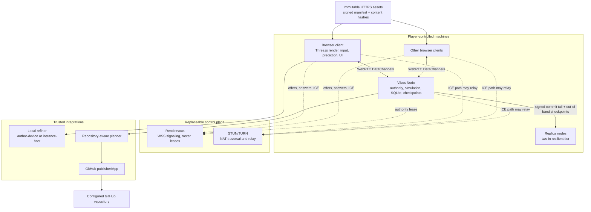

# Vibes Architecture

- **Status:** proposed architecture for Phase 0 validation
- **Scope:** runtime topology, simulation, transport, persistence, deployment, and technical trust boundaries
- **Related:** [Governance](./GOVERNANCE.md), [Resonance Reach](./FIRST_WORLD.md), [PLAN.md](../PLAN.md)

## Executive decision

Vibes will be peer-hosted but not leaderless. Each world epoch has one elected simulation authority, preferably a small `Vibes Node` process running on a player-controlled machine. Browser clients establish WebRTC DataChannel sessions with that authority; ICE may choose a direct path or relay every byte through TURN. A replaceable rendezvous service handles authenticated signaling, roster attestations, short-lived TURN credentials, and expiring authority fencing tokens; it does not relay normal frame-by-frame world state. WebRTC requires application-defined signaling and commonly needs TURN when a direct path is impossible ([WebRTC peer connections](https://webrtc.org/getting-started/peer-connections), [TURN guidance](https://webrtc.org/getting-started/turn-server)).

This authority star is the smallest architecture that provides one arbiter for physics, inventory, interactions, and persistence while preserving self-hosted operation. Eight browser players use eight client-node sessions with a separate preferred Vibes Node, or seven links when one player browser is the fallback authority. A full eight-player browser mesh would require 28 links and still would not decide which conflicting game outcome is correct.

“Peer-to-peer” therefore means that gameplay authority and durable world data live on community machines, not that every peer is equally trusted or that no supporting service exists.

## System view



## Four separate state machines

The design must not collapse these concerns into one generic “P2P state” layer:

1. **Realtime simulation** — latency-sensitive inputs, transforms, animation, transient physics, combat effects, and prediction.
2. **Durable world history** — objective state, inventory, spawned/removed entities, structures, world configuration, world-scoped player progress, checkpoints, and migration events. Personal accessibility/render/input settings stay local.
3. **Governance consensus** — identities, policy epochs, immutable proposals, acknowledgements, votes, approval certificates, and audit commitments.
4. **Software delivery** — project context, richer planning, issue rendering, GitHub publication, review, implementation, and releases.

Each has a different authority, consistency model, retention policy, failure behavior, and security boundary. Simulation authority never inherits world ownership or publisher credentials. Migrating simulation authority never transfers administrative power.

## Runtime components

### Browser client

- Direct Three.js game renderer and scene management.
- Shared simulation package for client prediction and browser-host fallback.
- React DOM overlay for menus, proposals, voting, administration, accessibility, and diagnostics; React does not own the realtime scene graph.
- Native `RTCPeerConnection` adapter with project-owned protocol behavior.
- Web Worker boundaries for simulation and optional author-device model inference. Browser WebRTC remains behind a main-thread adapter/message bridge because `RTCPeerConnection` is exposed to `Window`, not workers, in the current WebRTC Recommendation.
- IndexedDB for structured cache, OPFS for optional checkpoint blobs, and Cache Storage for immutable releases. Browser storage is a cache/fallback, not the only durable copy.
- Origin-scoped device identity plus an explicit encrypted export/migration or re-enrollment story; clearing storage or moving from the official origin to a self-hosted origin cannot silently become a new trusted human.

### Vibes Node

The preferred world authority is a local service distributed for macOS, Windows, and Linux.

- Runs the shared fixed-step simulation and authoritative validation.
- Accepts player inputs rather than client-computed outcomes.
- Hosts native WebRTC DataChannels through the library selected by the Phase 0 interoperability spike.
- Persists the world manifest, SQLite event log, checkpoints, governance log, and publication outbox.
- Replicates committed state to eligible peers.
- Exposes a loopback/operator API for local health, backup, model, and integration controls, protected from arbitrary web pages by origin checks, CSRF defenses, authenticated short-lived capabilities, and narrow method scopes.
- Can call author-local or instance-host Ollama when that disclosed local-refiner mode is selected.
- Never sends GitHub credentials, planner credentials, or unencrypted secrets to browsers.
- Must pass macOS/Windows/Linux native-module loading, package signing/notarization, installer/update, and rollback gates before it becomes the default host.

A foreground browser may host a temporary world when no node exists, but browser lifecycle freezing and best-effort/evictable storage make it unsuitable for the v1 durability promise ([Page Lifecycle](https://developer.chrome.com/docs/web-platform/page-lifecycle-api), [storage quotas and eviction](https://developer.mozilla.org/en-US/docs/Web/API/Storage_API/Storage_quotas_and_eviction_criteria)). The UI must label this limitation honestly.

### Rendezvous service

- Authenticated WSS signaling only: SDP offers/answers, trickled ICE candidates, roster summaries, and reconnect coordination.
- Issues expiring room and invite challenges; never trusts cosmetic display names.
- Transactionally allocates a monotonically increasing simulation epoch and signs a short-lived fencing token containing world, holder, epoch, issued-at time, validity interval, and latest witnessed commit index/hash.
- Refuses overlapping server-time validity intervals; persists allocation before response; exposes signed time samples plus restart/clock-uncertainty health; resilient/HA modes place the lease service outside the simulation-authority failure domain.
- In resilient/HA mode, transactionally records exactly one next 2-of-3 commit certificate that extends the witnessed index/hash chain and returns a signed witness receipt before the UI may call that index durable.
- Mints short-lived TURN credentials and applies connection/rate limits.
- Carries no normal simulation snapshots or bulk assets.
- Attests authenticated signaling/session rosters and mirrors signed governance events/log heads so governance can pause or continue independently of simulation-host migration.
- Can be project-operated, self-hosted, or replaced without changing the game protocol.

The fully self-hosted bundle includes rendezvous and Coturn. Internet self-hosting still needs a publicly reachable DNS/TLS endpoint and relay ports; LAN-only startup must work with no external STUN/TURN while still satisfying secure-origin and local certificate requirements.

Self-hosting has explicit durability tiers:

- **Single-box** — client/node/rendezvous/relay/publisher may share one machine. Backup and manual rehost are the honest recovery promise; host failure also removes leases and often TURN.
- **Resilient** — rendezvous/lease service is outside the authority failure domain, durably witnesses the commit chain, and the world has one authority plus two eligible replica nodes using a 2-of-3 commit certificate.
- **High availability** — a replicated linearizable lease/control service and redundant relay/publisher dependencies remove additional single points of failure.

Admin diagnostics display the active tier, recovery point, replica health, and unavailable guarantees. Packaging every service together does not imply migration resilience.

Resilient and high-availability safety is a crash/omission-fault guarantee. It trusts the lease/control service—or its linearizable quorum—not to equivocate and does not claim Byzantine consensus among the three world nodes. A 2-of-3 certificate without the durable control-service witness is evidence of signatures, not a committed world head; if an authority or control service acts maliciously, it may violate safety, simulation fairness, or availability and the world requires audit/operator recovery.

### Replica node

- Stores recent full checkpoints and the signed committed durable event tail.
- Verifies checkpoint, manifest, fencing token, event hash, and commit certificate/index.
- Reports lag and storage health.
- Becomes an authority candidate only if its trust role/version permit it and it holds the certificate plus control-service witness receipt for the latest committed head; a stale surviving replica causes a safe pause, not election.
- Receives checkpoint blobs through HTTPS or a distinct bounded replica transport/connection so a full snapshot cannot monopolize gameplay SCTP.
- Never gains owner, admin, or publisher capabilities merely by becoming simulation authority.

### AI and publisher adapters

- The local refiner implements one versioned structured-output contract across author-device WebLLM/Ollama and explicitly consented instance-host Ollama.
- The richer planner receives an approved proposal plus an explicit repository context pack and emits schema-constrained plan data without tools.
- A deterministic renderer turns valid plan data into Markdown.
- The GitHub publisher independently verifies the unanimous certificate, fixed target repository, plan hash, and outbox state before one API mutation.

Detailed policy lives in [GOVERNANCE.md](./GOVERNANCE.md).

## Connection and admission flow

1. The owner creates a world key and signed descriptor containing `worldId`, content/build hash, schema versions, owner/admin keys, join policy, eligible-host policy, rendezvous URL, and asset-manifest hash.
2. `vibes host` opens an outbound authenticated WSS session to the selected rendezvous. Home users do not need an inbound gameplay port.
3. An authorized member creates a single-use, expiring invite link, QR code, or short code containing the world ID, issuer/admin fingerprint, trust-policy epoch, nonce, expiry, and maximum role. It does not bind a transient simulation host.
4. A joiner loads a client from a declared trust source, creates or selects a persistent device key, and presents the invite. The official browser client is trusted through its HTTPS origin; an installed Vibes Node/launcher verifies a signed release manifest and key rotation; a self-hosted browser client is trusted by that operator. JavaScript delivered by an origin is not described as self-verifying its own signature.
5. An owner/admin approves the human-readable fingerprint when policy requires manual admission.
6. Rendezvous returns the current roster, authority epoch, protocol/build requirements, and expiring ICE server configuration.
7. Joiner and authority use perfect negotiation and Trickle ICE through WSS. Direct paths are preferred; TURN is used when NAT or policy prevents them.
8. The DataChannel handshake performs a challenge-response and binds the device identity, world ID, current fencing-token digest/epoch, protocol major, build hash, schema version, capability certificate, and connection transcript.
9. The authority rejects incompatible or unauthorized peers before processing world messages.
10. After an immutable base-content check, the authority sends the relevant durable checkpoint/event tail. The peer signs a `READY_SESSION_LEASE` only after authenticating, completing world sync, acknowledging the durable head, and controlling a non-spectator avatar. Governance derives its electorate from committed leases rather than a host-selected ready boolean.

The diagnostics UI uses browser WebRTC statistics for path/candidate protocol, round-trip time, bytes, buffered data, and send-side discards. DataChannel sequence numbers plus ping/clock samples measure loss, reordering, and jitter at the application layer; RTP media metrics are not claimed for data-only sessions.

## Transport protocol

WebRTC DataChannels are the primary gameplay transport because they provide browser P2P connectivity, ICE/STUN/TURN traversal, encryption, and both reliable and partially reliable delivery ([RFC 8831](https://www.rfc-editor.org/rfc/rfc8831.html)). [WebTransport](https://www.w3.org/TR/webtransport/) is browser-to-server, not a replacement for peer connectivity. WebSocket remains signaling and diagnostics only; v1 does not hide an unbudgeted gameplay relay behind the word “fallback.”

One peer connection carries three logical channels:

| Channel | RTC behavior | Carries | Failure policy |
| --- | --- | --- | --- |
| `realtime` | unordered, `maxRetransmits: 0` | inputs, transforms, animation, transient effects | discard stale packets; shed load before queueing |
| `durable` | reliable, ordered | entity lifecycle, inventory, objective state, world mutations | idempotent event IDs; bound queue; disconnect on protocol abuse |
| `control` | reliable, ordered | membership, fencing/commit metadata, checkpoint hashes, proposals, votes, certificates | signature/schema verification; mirror signed log heads |

Protocol rules:

- Inspect negotiated message-size limits and define a lower application cap. Normal realtime packets should remain near path-MTU size; RFC 8831 recommends messages no larger than 16 KiB when interleaving is unavailable. Assets and full checkpoint blobs never use the gameplay association.
- Use sequence, tick, world, authority epoch, fencing-token digest/expiry, protocol version, and message type on simulation envelopes. Governance uses its own policy/trust/presence epochs.
- Apply `bufferedAmount` thresholds, bounded priority queues, per-type rate limits, and packet shedding. Reliable backlog must not stall realtime behavior invisibly.
- Generate durable/control messages from versioned schemas. Hot transform batches use an explicit `DataView` codec with fixed little-endian byte order, field alignment, quantization/range rules, canonical finite-number handling, NaN rejection, and a versioned layout—never host-memory typed-array representation as an implicit wire format.
- Canonical signed governance objects use the [JSON Canonicalization Scheme](https://www.rfc-editor.org/rfc/rfc8785.html) or deterministic [CBOR](https://www.rfc-editor.org/rfc/rfc8949.html) selected in Phase 0; signatures never cover ambiguous free-form serialization.
- Reject unknown major versions and unsupported required features. Ignore only explicitly forward-compatible fields.
- Send assets over HTTPS as immutable objects referenced by SHA-256 in a signed manifest. Use glTF/GLB, Meshopt geometry, and KTX2/Basis textures.

## Simulation model and initial budgets

One shared simulation package runs in Vibes Node, browser prediction workers, tests, and browser-host fallback.

| Concern | Initial budget |
| --- | --- |
| Render | display cadence, normally 60 Hz |
| Authority simulation | fixed 30 Hz until profiling justifies 60 Hz |
| Input submission | 30 Hz with sequence and a small redundant input tail |
| State snapshots | 10–15 Hz, delta- and interest-filtered |
| Remote interpolation | adaptive, initially 100–150 ms |
| Migration checkpoint | every 5 seconds plus major durable transitions |
| Governance/durable commit | immediate, acknowledged, idempotent |

State partitions:

- **Immutable base** — signed release/build, world seed, terrain recipe, asset manifest, collision data, and protocol schemas.
- **Durable overlay** — objective state, inventory, spawned/removed entities, placed objects, world configuration, and world-scoped player progress.
- **Ephemeral simulation** — transforms, velocities, animation blends, transient contacts, particles, and short-lived combat effects.
- **Local profile outside world history** — accessibility, input, camera, render, audio, and privacy preferences.
- **Governance outside world history** — memberships, proposals, votes, certificates, and audit events in their own signed log.

Only the durable overlay enters the append-only event log. Thirty-hertz transforms are snapshots, not history.

Open-world rules:

- Stable integer chunk/cell IDs plus quantized local offsets avoid large-world coordinate drift.
- Authority calculates an area of interest for each player and reliably sends chunk enter/leave plus durable chunk state.
- Snapshot deltas contain only relevant changed live entities.
- Clients predict only locally owned movement and replay unacknowledged inputs after reconciliation.
- Authority owns collision, damage, inventory, collectible, puzzle, and interaction results.
- Durable operations carry unique IDs and preconditions so retries cannot duplicate a shard, reward, or GitHub-triggering event.

Rapier JS/WASM is the proposed physics layer because it provides a character-controller foundation, serialization, and cross-platform deterministic behavior when the version, initial conditions, insertion order, and all inputs are identical ([Rapier determinism](https://rapier.rs/docs/user_guides/javascript/determinism/)). The simulation must avoid assuming that unrelated JavaScript calculations such as platform-dependent transcendental functions are automatically deterministic.

“Replay” has three deliberately different meanings:

- **Recovery replay** restores a trusted checkpoint and applies the durable committed tail. It recovers state but does not prove every ephemeral simulation decision was fair.
- **Deterministic test replay** records the complete tick-scheduled input/event stream and verifies cross-platform hashes in controlled tests.
- **Adversarial verification** would require replicas to shadow-simulate or retain/verify all signed inputs. This is not an MVP guarantee; without it, signed checkpoints/logs provide integrity and diagnostics, not proof that a malicious host simulated honestly.

## Persistence and recovery

The portable world bundle contains:

```text
signed world descriptor and trust policy
release, protocol, schema, and asset-manifest hashes
world seed and immutable content references
periodic simulation + Rapier checkpoints
append-only durable event tail
governance events and approval certificates
integration configuration without secret values
integrity manifest
```

- SQLite is the authoritative node store, with transactional event/checkpoint/outbox updates.
- Checkpoints are content-addressed and retain enough recent generations for rollback/recovery.
- Resilient mode runs one authority plus two eligible replicas. A durable index/hash is committed only when any two of those three sign the same current-epoch certificate over index, hash, and parent hash, and the lease/control service transactionally records it as the unique next head. The UI acknowledges durability only after receiving the signed witness receipt.
- Checkpoint metadata/hash and the durable tail use control/durable messages, while checkpoint blobs move through authenticated HTTPS or a distinct chunked/backpressured replica connection. Saturation tests prove this transfer cannot starve realtime traffic.
- A `.vibes-world` export is explicit, versioned, hash-verified, and restorable without a project-operated service.
- Secrets are references to OS keychain, container secret, or operator-provided protected storage and never appear in the portable world export.
- Upgrades pin a release and schema, create a verified backup, run explicit migrations, and never load executable code directly from a proposal or model output.

### MVP authority loss

The first multiplayer alpha pauses durable interactions, saves/exports the latest known checkpoint, and guides players through rehosting/rejoin. It does not claim seamless migration.

### v1 migration

- The lease service transactionally allocates and signs `{worldId, holderId, epoch, issuedAt, notBefore, expiresAt, committedIndex, committedHash}`. Allocation survives restart, and a new token's `notBefore` is never earlier than the previous token's `expiresAt` in server time.
- Authorities and validators bound their offset from signed server-time challenge responses using local send/receive times, convert the bound to monotonic local deadlines, and refuse durable operation when uncertainty exceeds policy. The old authority stops when the latest possible server time reaches `expiresAt`; the new authority starts only when the earliest possible server time reaches `notBefore`; validators accept only when the entire possible server-time interval lies inside the token. This deliberately creates a safe gap under clock skew rather than overlapping acceptance.
- Authority renews well before that conservative stop deadline and stops durable writes when renewal cannot be proven, even if some clients remain connected.
- Two replica nodes receive checkpoints and the committed tail; each commit has a current-epoch 2-of-3 signed index/hash/parent certificate. The lease service verifies that it extends the witnessed head, transactionally records exactly one certificate for the next index, and returns a signed witness receipt before durability is acknowledged.
- On lease loss or expiry, durable interactions pause. A stale old host isolated with clients becomes fenced when its token expires rather than serving indefinitely at the old epoch.
- The lease service grants a higher epoch only to an eligible replica that presents its witness receipt and data for the control service's durable latest index/hash. That recorded head, rather than whichever candidate answers first, defines “latest.” If the witness is unavailable, receipts disagree, or only a stale replica survives, Vibes pauses for operator recovery instead of acknowledging rollback.
- The new authority restores the checkpoint/tail for that commit index, publishes its state hash/token, and accepts fresh peer connections. All peers reject old or expired tokens; a returning former host cannot self-promote.
- Without a reachable lease service and required freshness/quorum, Vibes chooses consistency and pauses rather than creating split histories.

Expected migration is a visible bounded pause and reconnection, not an impossible transparent transfer of an existing SCTP association.

## Trust boundaries and residual risks

| Threat | Primary control | Honest residual statement |
| --- | --- | --- |
| Modified client movement/inventory | input-only protocol, rate/velocity/collision/precondition checks | a compromised authority can waive its own checks |
| Malicious authority | trusted-host policy, visible identity, signed durable events, commit certificates, checkpoint hashes, diagnostics | without shadow simulation, a player-owned host cannot be made incapable of cheating or censorship |
| Signaling interception | HTTPS/WSS, expiring capabilities, identity challenge, transcript binding | a rendezvous can still deny service |
| Split brain | conservative clock-uncertainty windows, expiring fencing tokens, witnessed 2-of-3 commit chain, latest-witnessed-head election, pause without safety | availability is sacrificed when lease/witness/freshness is unknown; Byzantine control-service safety is not claimed |
| Peer IP exposure | clear disclosure and `relay` ICE policy privacy mode | the TURN operator then sees addressing and carries traffic |
| TURN theft or flood | short-lived HMAC credentials, byte/session limits, port constraints, egress alerts | relay capacity still needs operational funding |
| Message/resource exhaustion | schema and size caps, rate limits, bounded queues, backpressure, disconnect policy | authorized peers can still consume their allowed share |
| Malicious assets/release | signed manifest, hashes, CSP, pinned build, reviewed release keys | release-signing authority remains powerful |
| Prompt injection | untrusted-data delimiters, no model tools, schema output, independent validation | human review remains required before implementation |
| GitHub credential theft | node/gateway only, least privilege, short-lived tokens, secret storage | owner or publisher machine compromise remains in scope |

Competitive or public worlds may eventually require a dedicated authority trusted by the community. That service can still be self-hosted; “P2P” must never be marketed as a fairness proof.

## Proposed repository shape

```text
apps/
  web/                 Three.js client and React interface
  vibes-node/          player-owned authority, persistence, local services
  rendezvous/          signaling, leases, invite challenges, TURN credentials
packages/
  game-core/           deterministic simulation and entity systems
  world/               chunks, manifests, objectives, content definitions
  protocol/            network schemas, codecs, versions, compatibility
  governance/          identity, events, proposals, votes, certificates
  ui/                  shared accessible application components
  testkit/             deterministic fixtures, transport emulator, fault tools
infra/
  coturn/               self-host configuration and hardening
  containers/          additive build and deployment definitions
tests/
  browser/              multi-browser and visual tests
  network/              interoperability, impairment, soak, migration tests
  security/             fuzz, injection, signature, capability tests
docs/                   product, architecture, operations, and decisions
```

The first scaffold should keep package boundaries real but avoid creating empty abstraction layers. A package exists only when two runtimes share it or a trust boundary requires it.

## Proposed stack

| Area | Initial choice | Reason / gate |
| --- | --- | --- |
| Language/workspace | strict TypeScript, pnpm workspaces | shared schemas and simulation across browser and Node |
| Game renderer | direct Three.js `WebGLRenderer` behind a small adapter | stable baseline; current `WebGPURenderer` remains experimental |
| UI | React DOM overlay | strong form/admin/accessibility ecosystem without owning the scene graph |
| Physics | `@dimforge/rapier3d` | WASM, character controller, snapshots, determinism profile |
| Entity model | small bitECS-style data-oriented core | explicit data and serialization; validate ergonomics in spike |
| Browser transport | native `RTCPeerConnection` wrapper | full control over ICE restart, stats, negotiation, limits, and backpressure |
| Node transport | `node-datachannel`, Werift fallback | must pass browser/OS packaging and soak spike before lock-in |
| Relay | Coturn | mature self-hosted STUN/TURN with ephemeral credentials |
| Protocol | Protobuf + explicit little-endian `DataView` hot-path codec; JCS/deterministic CBOR for signatures | compact binary data and unambiguous versioned signed objects |
| Persistence | SQLite on node; IndexedDB/OPFS cache in browser | transactional durable host plus portable fallback/cache |
| Local inference | common adapter; WebLLM versus Ollama selected by bakeoff | privacy and zero-install versus compatibility and GPU contention |
| Validation | Zod or Valibot at every untrusted boundary | one typed schema source with explicit caps |
| Tests | Vitest, Playwright, property/replay tests, network fault harness | pure state machines plus real browsers and adversarial paths |

Dependencies and exact versions are pinned only when the corresponding Phase 0 evidence is recorded.

## Phase 0 decision gates

The architecture is accepted only after the repository records results for:

1. Chrome, Firefox, and Safari browser-to-node interoperability, including main-thread/worker message boundaries.
2. LAN-only startup without external STUN/TURN, then residential NAT, CGNAT/mobile, IPv6/mixed, forced TURN/UDP, and TURN/TLS paths with secure-origin and mDNS behavior recorded.
3. macOS, Windows, and Linux native module loading, packaging, signing/notarization, install/update/rollback, and browser-host fallback behavior.
4. Eight-player authority-star soak with measured CPU, memory, bandwidth, queue, relay cost, and exact application-layer loss/reordering/jitter telemetry.
5. Reliable-channel saturation and a simultaneous full checkpoint transfer proving bounded queues and realtime packet shedding.
6. Asymmetric partitions, adversarial clock offsets and delay, conservative lease stop/start boundaries, fencing-token expiry/renewal, rendezvous restart/epoch persistence, a host still connected after lease loss, and old-host reappearance.
7. The witnessed 2-of-3 commit/election failure matrix, including authority-plus-one-replica commit, same-index equivocation attempts, witness crash before/after receipt, stale-only survivor, replica disagreement, and unavailable lease/witness safe pause.
8. Device identity loss, browser-storage clearing, official-to-self-host origin migration, invitation/re-enrollment, and signed ready-session lease completeness.
9. Loopback Vibes Node/Ollama origin authentication, CSRF/capability scoping, request logging, and attacks from arbitrary web pages.
10. Cold model download integrity/quota/eviction/offline behavior plus renderer frame p95/p99, authority tick jitter, CPU/GPU/memory contention, unsupported WebGPU, and fallback.
11. Recovery replay, complete-input deterministic test replay hashes, and explicit proof that no stronger adversarial-verification claim is made without shadow simulation.
12. Signed-governance electorate/certificate verification and event mirroring independent of simulation authority migration.
13. GitHub fault injection for “request accepted, response lost,” startup from `POST_IN_FLIGHT`, marker reconciliation, and a no-automatic-repost attention state.
14. A Phase 0 topology spike using the project protocols with two peers, custom rendezvous, forced Coturn, local node, synthetic certificate, and sandbox publisher. Complete polished operator packaging remains a Phase 5 gate.

## Source notes

- [WebRTC peer connections and signaling](https://webrtc.org/getting-started/peer-connections)
- [WebRTC TURN guidance](https://webrtc.org/getting-started/turn-server)
- [WebRTC DataChannel protocol, RFC 8831](https://www.rfc-editor.org/rfc/rfc8831.html)
- [WebRTC browser recommendation](https://www.w3.org/TR/webrtc/)
- [WebRTC statistics](https://www.w3.org/TR/webrtc-stats/)
- [WebTransport browser-to-server transport](https://www.w3.org/TR/webtransport/)
- [TURN protocol and transports, RFC 8656](https://www.rfc-editor.org/rfc/rfc8656.html)
- [WebRTC perfect negotiation](https://developer.mozilla.org/en-US/docs/Web/API/WebRTC_API/Perfect_negotiation)
- [Chrome Page Lifecycle](https://developer.chrome.com/docs/web-platform/page-lifecycle-api)
- [Browser storage quotas and eviction](https://developer.mozilla.org/en-US/docs/Web/API/Storage_API/Storage_quotas_and_eviction_criteria)
- [JSON Canonicalization Scheme, RFC 8785](https://www.rfc-editor.org/rfc/rfc8785.html)
- [CBOR, RFC 8949](https://www.rfc-editor.org/rfc/rfc8949.html)
- [Three.js WebGPU renderer status and WebGL fallback](https://threejs.org/manual/en/webgpurenderer)
- [Rapier JavaScript determinism](https://rapier.rs/docs/user_guides/javascript/determinism/)
- [Rapier JavaScript character controller](https://rapier.rs/docs/user_guides/javascript/character_controller/)
- [Coturn](https://github.com/coturn/coturn)
- [`node-datachannel`](https://github.com/murat-dogan/node-datachannel)
- [GitHub App credential guidance](https://docs.github.com/en/apps/creating-github-apps/about-creating-github-apps/best-practices-for-creating-a-github-app)
- [GitHub create-issue endpoint](https://docs.github.com/en/rest/issues/issues#create-an-issue)
