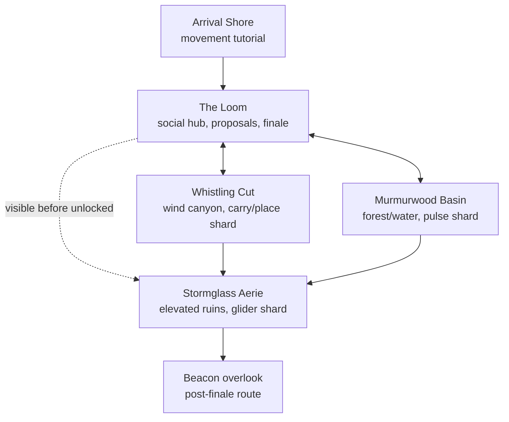

# Resonance Reach — Initial World Design

- **Status:** proposed vertical-slice design
- **Working names:** intentionally changeable after visual exploration
- **Target:** v0.1 solo, v0.2 two-to-eight-player adventure, v0.3 signed proposal/vote loop, v0.4 planned GitHub publication

## Design north star

The first Vibes world must answer two questions in one session:

1. Would people choose to keep playing this even if the governance idea did not exist?
2. Does proposing the next improvement feel like a natural extension of playing together?

The answer should come from a compact, dense, vertical, visually rich place—not a giant empty terrain demo. Resonance Reach is a seamless 768×768-meter island and sky-ruin region with a scenic horizon several times larger. It feels open because players can see meaningful destinations, choose routes, climb to new layers, glide back across known spaces, and alter a shared finale. Hand-authored landmarks sit within reusable terrain, vegetation, weather, and chunk systems so later releases can expand without replacing the foundation.

It is inspired by the freedom and systemic clarity of excellent open-world adventures, but it must use original world, characters, terminology, assets, audio, mechanics, silhouettes, and visual identity.

## Player fantasy

Players are Wayfinders arriving in a landscape whose dormant structures respond to resonance. They explore three contrasting regions, recover three lost Shards through movement and environmental problems, and bring them to a central machine called the Loom. Reuniting the Shards changes the weather and sky, activates a distant Beacon, and opens a spectacular new route.

The fantasy is not “be the strongest hero.” It is:

- discover a place by moving through it;
- notice how its systems connect;
- solve something more elegantly with friends;
- leave the world measurably different;
- tell the group what would make the next visit better.

## World shape

The map opens after the first few minutes: Murmurwood Basin and Whistling Cut can be completed in either order, while Stormglass Aerie is a visible synthesis/final region unlocked by the first two Shards. Each region still exposes route choice and a return shortcut. High places reveal objectives through silhouette, light, sound, wind, and landmark composition rather than a dense minimap.

### Arrival Shore

- Safe space to learn camera, run, jump, mantle, interaction, and the visual language of climbable surfaces.
- First view frames the Loom, one high ruin, and the Beacon so the world’s promise is visible immediately.
- A small optional route rewards experimentation with a cosmetic resonance tone or vista, not required power.

### The Loom

- Central social landmark and navigation anchor.
- Holds the three Shard sockets and visibly changes as progress arrives.
- Makes Murmurwood and Whistling available together; the first two installed Shards open the Stormglass synthesis route.
- Serves as the diegetic Conclave: active proposals appear as a readable constellation of cards, with full accessible UI available by interaction or hotkey.
- Provides a safe return point, settings/diagnostics access, group emotes, and the final activation sequence.

### Murmurwood Basin

- Layered forest, shallow water, luminous plants, fog pockets, and natural arches.
- Teaches the Resonance Pulse through flora, moving roots, and one lightweight Glitch Wisp.
- Shard challenge combines observation, a sound/light sequence, and a short climb.
- Alternate high and low paths reconnect to the Loom and Aerie.

### Whistling Cut

- Wind-carved canyon with moving air, bridges, tunnels, tall grass, cloth, and dust revealing forces.
- Introduces one systemic carry/place object: the Tuning Stone.
- Pressure sockets, moving platforms, and wind baffles create a puzzle that is faster and more expressive with two players but solvable solo through a movable counterweight route.
- Its upper exit teaches glider launch and shows the Aerie objective.

### Stormglass Aerie

- Vertical ruins above the cloud line, reached by climbing, wind columns, and gliding.
- Combines the earlier pulse and Tuning Stone rules without introducing another major mechanic.
- The Shard sits in a visible chamber that players repeatedly approach from different heights.
- Installing the Aerie’s final Shard at the Loom activates the Beacon and reveals a new glide route to its overlook.

### Beacon overlook

- Short post-finale reward route with the strongest vista, musical resolution, session summary, and group photo moment.
- The changed sky and activated distant structures demonstrate that the world remembers player action.
- A clear Conclave prompt invites feedback while the experience is fresh without blocking continued exploration.

## First-session arc

| Time | Intended experience |
| --- | --- |
| 0–3 minutes | Fast load, striking reveal, responsive movement, obvious central landmark |
| 3–7 minutes | Reach the Loom, understand the three-Shard goal, choose Murmurwood or Whistling Cut |
| 7–18 minutes | Complete the two foundational regions in either order; learn pulse, carry/place, wind, climb, and glide |
| 15–25 minutes | Enter Stormglass as a synthesis region, cooperate, cross paths, emote/ping, and recover the final Shard |
| 20–30 minutes | Activate the Loom, experience the sky/Beacon event, take the new route, review session summary |
| after finale | Explore missed paths or open the Conclave and propose an improvement |

The target is 15–30 minutes for objective completion and at least another 15 minutes of optional discovery. The game should never hold the proposal system hostage behind completion; eligible players can open it at any time.

## Mechanics budget

### Traversal

- Third-person run and sprint.
- Jump with coyote time and input buffering.
- Mantle at readable ledges.
- Designated-surface climb with visible stamina/readability constraints only if playtests show it adds decisions; avoid universal expensive collision climbing initially.
- Glider with wind lift and controllable descent.
- Camera orbit, collision, recenter, sensitivity, field of view, inversion, shake, and motion options.

Movement feel is the first polish priority. Animation can be stylized, but input latency, collision response, grounding, slopes, steps, edge cases, and camera behavior must be measured and tuned.

### Systemic interactions

- `Resonance Pulse`: short-range activation/stun tool with clear cooldown and audiovisual response.
- `Tuning Stone`: one carryable/placable physics archetype with authoritative ownership, sockets, drop recovery, and duplicate prevention.
- Pressure plates/sockets.
- Doors and reversible barriers.
- Moving platforms.
- Wind volumes and baffles.
- Shards and the Loom’s durable three-slot state.

Each system must combine with at least one other system. Adding isolated one-off puzzle scripts is less valuable than deepening these few readable rules.

### Glitch Wisp

One enemy-like behavior provides motion, mild stakes, and a reason to use Pulse:

- patrols or orbits a resonance source;
- notices nearby players;
- disrupts/delays rather than dealing complex damage;
- can be stunned and bypassed;
- has one or two visual variants using the same logic;
- cannot demand a full weapon, loot, health, AI director, or combat-progression system.

The first slice is an adventure with a light hazard, not a combat vertical slice.

## Multiplayer moments

The world remains completable solo, but two-to-eight-player play should create memorable advantages:

- Players see avatars, chosen colors, short nameplates, emotes, and pings.
- A friend can hold a pressure state while another moves a Tuning Stone, shortening the Whistling Cut route.
- Players can pass or jointly position the shared object under clear authority rules.
- Wind and glider routes encourage visible group departures and reunions.
- Pulse effects and Wisp behavior are shared and converge quickly.
- Shards are world objectives, not per-player duplicates.
- The Loom visibly celebrates each returning player and the final group.
- Late joiners receive objective truth and can contribute immediately.
- The Beacon overlook creates a natural shared pause for the proposal loop.

No puzzle should hard-lock because a player disconnects, leaves an object in an invalid location, or takes a Shard out of range. Reset and recovery are part of the design, not debug commands.

## Proposal loop in the world

The governance UI has two entrances:

1. A global hotkey/menu available during ordinary play. It can attach the current region, build, coarse location, objective, and quality/network summary. Screenshot context remains disabled until local redaction and exact-pixel preview meet the governance privacy gate.
2. The Loom’s Conclave view, where proposals appear as world-space lights/cards and expand into an accessible 2D interface.

Player experience:

- Write a raw thought in everyday language.
- See a clear disclosure of where local inference runs and what context it will receive.
- Watch refinement progress without freezing the world/render thread.
- Review/edit a structured title, problem, desired experience, acceptance signals, non-goals, and open questions.
- Confirm what will be shared.
- See the same proposal, frozen voter roster, deadline, and vote state as everyone else.
- After approval, watch states change from planning to publication.
- Find the final issue link and non-sensitive provenance in the Conclave.

The world-space presentation adds character but never replaces standard text, keyboard navigation, screen-reader semantics, focus handling, or a reduced-motion mode.

## Art direction

### Visual thesis

**Tactile solarpunk fantasy shaped by sound and wind.** Broad readable forms, painterly gradients, strong landmark silhouettes, animated natural systems, and restrained luminous resonance effects should feel warm and handmade rather than photoreal or generically “AI fantasy.”

Working palette families:

- Loom/Arrival: warm stone, coral light, teal shadow.
- Murmurwood: moss, deep blue-green water, violet bioluminescence.
- Whistling Cut: ochre rock, pale grass, turquoise wind cloth.
- Stormglass: cool slate, cloud white, amber circuitry.
- Governance UI: quiet dark glass with warm human-authored text and distinct cyan/amber/red state semantics backed by icons and labels.

Production principles:

- Hand-author the five hero silhouettes and route composition.
- Procedurally scatter secondary vegetation/rocks from deterministic seeds with artist-authored masks.
- Use modular glTF kits, Meshopt geometry, KTX2 textures, LODs, impostors, instancing, baked/static lighting where appropriate, and bounded transparent effects.
- Prefer a few excellent materials, animations, and weather transitions over large asset counts.
- Maintain an asset provenance/license manifest from the first imported file.

### Audio thesis

Resonance is audible world state:

- each region has a sparse motif and ambience layer;
- Shards add voices to the Loom’s music;
- wind strength is spatially legible;
- Pulse responses use pitch and rhythm as well as color;
- the Beacon finale resolves the three motifs together;
- interaction, warning, and vote feedback always has caption/visual equivalents.

Voice chat is out of scope. Emotes, pings, and environmental audio support coordination without adding a moderation-heavy communications system.

## Persistence model

The first world persists only meaningful durable state:

- world/release/manifest version and deterministic seed;
- Shard discovered, carried, recovered, and installed state;
- Tuning Stone canonical location/socket or reset state;
- puzzle/door/platform durable flags;
- Loom and Beacon completion;
- world-scoped player spawn/checkpoint and discovered-progress state;
- optional discovered vistas/cosmetics;
- proposal/governance references in their separate signed log.

Transient transforms, particles, Wisp moment-to-moment movement, and animation blends are snapshots, not event history.

Accessibility, input, camera, render-quality, audio, and other personal settings remain local to the player’s device/profile unless a future explicitly named setting is world-scoped. They are not replicated as shared world history.

## Performance and delivery budgets

Phase 0 selects exact reference devices, but the initial quality targets are:

- Desktop Chrome, Firefox, and Safari on supported recent releases; one 2021-class laptop is the published baseline.
- At 1080p medium quality, four-peer play targets at least 50 FPS median, a 30 FPS 1%-low, and p95 frame time at or below 33 ms on the baseline; eight-peer low/medium targets at least 30 FPS median, a 20 FPS 1%-low, and p95 frame time at or below 50 ms.
- Quality scaling controls resolution, shadows, vegetation, water/reflections, post effects, particles, and view distance independently.
- The game-only GPU-memory target is at most 1.5 GB on the baseline quality tier. Local-model load/unload must not cause device loss and must return game memory to within 10% of its pre-inference level.
- Initial game payload is measured separately from optional model weights: target at most 25 MB compressed to first interaction and 150 MB compressed for the full initial world pack.
- On a 50 Mbps connection, first interactive play begins within 20 seconds cold and materially faster warm.
- Loading presents real phase/progress and a useful failure/retry path.
- No local-inference main-thread stall exceeds 100 ms. Workers isolate JavaScript work but not shared GPU queues, memory, compilation, or thermals, so p95/p99 frame time and authority tick jitter are measured during model load, inference, and unload; the UI pauses inference or falls back when budgets fail.
- Under a defined bidirectional impairment distribution averaging 100 ms RTT and 2% injected message loss, 95% of remote transform updates render within 250 ms and durable interactions converge within 500 ms. Sequence and ping samples provide application-layer loss, reordering, and jitter evidence because DataChannel statistics do not expose RTP-style packet-loss/jitter metrics.
- Eight players stay within documented authority CPU, memory, upstream bandwidth, DataChannel queue, and TURN-relay budgets.

These are release gates to validate, not claims to publish before measurement.

## Accessibility baseline

- Full keyboard remapping and gamepad support.
- Camera sensitivity, inversion, field of view, shake reduction, motion blur off, and reduced-motion transitions.
- Hold/toggle options for sprint, glide, and climb.
- Subtitle/caption presentation for narrative, objective, warning, and meaningful audio cues.
- Text/UI scaling and safe focus at game/menu transitions.
- High-contrast interaction outline and icon/shape redundancy.
- No color-only Shard, network, proposal, acknowledgement, or vote state.
- Adjustable timing or non-timed alternative for the cooperative puzzle in solo/accessibility mode.
- Pause-friendly solo play; multiplayer communicates what does and does not pause.

## Measurable slice acceptance

### World and play

- Five first-time players independently reach the Loom and understand the three-Shard objective.
- At least four complete the objective in 15–30 minutes without developer guidance.
- At least four report that traversal or exploration alone makes them want to continue/replay.
- Every critical destination is discoverable through world cues; objective UI supports rather than replaces spatial design.
- Solo and two-player routes complete without reset commands.
- All three regions have a distinct silhouette, movement texture, audio identity, and memorable reveal.
- Beacon completion changes sky/audio/world state and survives save, restart, export, and restore.

### Multiplayer

- Two to eight invited players join without manual port forwarding.
- All clients agree on Shard, Tuning Stone, puzzle, Wisp, Loom, and Beacon durable state.
- No disconnect or late join creates a duplicate Shard, contradictory door, orphaned object, or impossible objective.
- A 45-minute eight-player soak on the support matrix has no fatal desync or unbounded channel queue.
- Authority loss produces a clear pause/recovery/export path; seamless migration is not claimed until its later gate passes.

### Proposal experience

- A player can capture contextual feedback, refine it locally, edit, share, and reach a vote without leaving the game.
- Every voter displays the same content and electorate hashes.
- A complete healthy all-yes path reaches a published sandbox issue within 90 seconds at p95 once Phase 4 is enabled.
- The Conclave clearly distinguishes `approved`, `planning`, `plan ready`, `publish pending`, `post in flight`, `unknown/reconciling`, `paused`, `published`, and `needs attention`.
- No screenshot, location, metric, identity, or issue content leaves its disclosed boundary without explicit consent.

## Scope guard and cut order

Do not add these to the first slice:

- infinite/procedural world claims;
- freeform building or destruction;
- weapon classes, deep combat, loot, armor, skill trees, or crafting;
- mounts, vehicles, farming, survival meters, or economy;
- NPC dialogue trees, factions, settlements, or procedural quests;
- voice chat or public matchmaking;
- user mods or downloadable executable content;
- mobile-native controls, VR, or console packaging;
- automatic code generation/deployment from proposals.

If schedule or performance is threatened, cut in this order:

1. Optional vistas/cosmetics and secondary environmental variety.
2. Wisp visual variants and nonessential behavior.
3. Day/night breadth, retaining one authored transition and finale sky.
4. Extra route branches, retaining two entrances/one shortcut per core region where possible.
5. Browser-host fallback polish, retaining the preferred Vibes Node path.

Do not cut movement feel, the three-region identity, the shared objective, save recovery, authoritative convergence, proposal consent, or accessibility fundamentals. Those are the vertical slice.

## Production order

1. Graybox Arrival, Loom, one representative region route, and the high-level world silhouette with movement metrics visible.
2. Tune traversal/camera, implement save/restore, and bring that Arrival–Loom–region route to target art/audio/accessibility quality.
3. Pass the quality-corner frame, memory, compressed-byte, asset-throughput, recovery, and first-time-player gate before multiplying content.
4. Build Pulse, Tuning Stone, sockets, wind, and durable Shard state as composable systems in graybox.
5. Network the graybox objective over the real authority transport before finishing all regions.
6. Complete Murmurwood and Whistling in either order, then build Stormglass as their synthesis/final region.
7. Validate the full solo objective, multiplayer state, save/export/restore, and measured budgets.
8. Finish multiplayer moments and remaining atmosphere only within those budgets.
9. Integrate the Conclave using mock publication, then real signed governance and GitHub states in later phases.
10. Run structured first-session playtests at every stage and remove features that do not improve the core arc.
