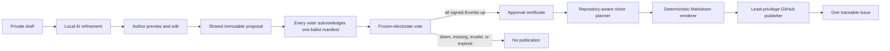

# Vibes Governance, Trust, and AI-to-GitHub Design

- **Status:** proposed constitution for Phase 0 validation
- **Scope:** identity, trust, proposals, unanimous voting, local refinement, repository planning, publication, administration, abuse, audit, and privacy
- **Related:** [Architecture](./ARCHITECTURE.md), [PLAN.md](../PLAN.md)

The electorate definition and policy defaults below are a decision-ready recommendation, not yet a founder-approved constitution. Phase 0 must confirm or amend them before implementation freezes protocol schemas.

## Product promise

Vibes turns an experience from play into accountable development work:



The vote authorizes publication of the approved outcome as one planned GitHub issue. It does not authorize implementation, prioritization, code generation, merging, release, deployment, or live modification of the world.

## Constitutional invariants

These rules are protocol guarantees, not UI conventions:

1. An author explicitly confirms the exact proposal revision before it becomes shared or voteable.
2. Ballot preparation atomically freezes the canonical proposal hash, electorate, policy, target repository, planner/privacy policy, and deadline before acknowledgements begin. Every electorate member acknowledges that same ballot manifest before voting opens.
3. A shared proposal revision is immutable. Any textual or contextual change creates a new revision and invalidates acknowledgements and votes.
4. Approval requires one valid signed thumbs-up from every identity in the frozen electorate. No host/admin boolean can substitute for signatures.
5. A missing, invalid, expired, or negative vote can never be interpreted as approval.
6. Disconnecting a voter does not reduce the electorate. Reconnecting with the same identity allows that player to act before expiry.
7. Before approval, admins may quarantine or cancel a proposal for safety with a visible signed reason. After approval, operators may pause planning/publication or mark it `NEEDS_ATTENTION`, but cannot rewrite the proposal, discard its certificate, mark it rejected, impersonate a voter, or shrink an electorate into approval.
8. Approval is durable across planner, provider, network, and GitHub outages. Recovery resumes planning/publication without another vote.
9. The player-approved title and outcome remain verbatim in the issue. A richer model may elaborate implementation but may not silently replace scope.
10. Models produce validated data only. They never receive publisher credentials or action tools.
11. Exactly one numeric repository identity is bound before voting. The model and proposal text cannot choose or redirect publication.
12. A released game update still follows normal review, testing, signing, and operator-controlled upgrade paths.

## Proposal state machine

```text
LOCAL_DRAFT -> REFINING -> AUTHOR_PREVIEW -> DISTRIBUTING -> QUEUED

QUEUED -> QUARANTINED -> QUEUED | WITHDRAWN
QUEUED -> BALLOT_PREPARING -> QUEUED | VOTING
VOTING -> APPROVED | REJECTED | EXPIRED | WITHDRAWN | CANCELED_BY_POLICY

APPROVED -> PLANNING
PLANNING -> PLAN_READY | NEEDS_ATTENTION
PLAN_READY -> PUBLISH_PENDING
PLANNING | PLAN_READY | PUBLISH_PENDING -> PAUSED(previous state)
PUBLISH_PENDING -> POST_IN_FLIGHT
POST_IN_FLIGHT -> PUBLISHED | UNKNOWN_RECONCILING
UNKNOWN_RECONCILING -> PUBLISHED | NEEDS_ATTENTION

NEEDS_ATTENTION -> PLANNING | PLAN_READY | PUBLISH_PENDING | UNKNOWN_RECONCILING
PAUSED(previous resumable state) -> previous resumable state
PUBLISHED is terminal
```

- `LOCAL_DRAFT`, `REFINING`, and `AUTHOR_PREVIEW` are private to the author’s declared local inference boundary.
- `DISTRIBUTING` begins only after author confirmation. All ready peers receive the canonical revision and return signed `PROPOSAL_RECEIVED` receipts. A receipt proves delivery, not consent or ballot eligibility.
- `QUEUED` is visible to all connected trusted players. One vote is active at a time by default so discussion and attention remain legible.
- `QUARANTINED` is a pre-approval moderation hold with an append-only reason and appeal/resubmit path. It cannot modify content.
- `BALLOT_PREPARING` atomically creates one immutable ballot manifest containing the proposal revision/hash, committed presence snapshot, eligible electorate, governance/trust epochs, target repository, planner/privacy policy, and deadline. Prospective voters verify and sign `BALLOT_MANIFEST_ACKNOWLEDGED`. If every acknowledgement does not arrive within the preparation timeout, the ballot is abandoned and the proposal returns to `QUEUED`; the electorate is never silently reduced.
- `VOTING` begins only from the fully acknowledged ballot manifest and cannot recalculate its electorate, policy, repository, or deadline.
- `APPROVED` is terminal for consent. It cannot become rejected because an external service is down.
- `NEEDS_ATTENTION` is resumable and preserves the certificate and exact failure. An operator may repair configuration/retry but may not reject the approval or publish changed proposal scope without a new revision and vote.
- `PAUSED` is an explicit operator hold before any HTTP mutation. `UNKNOWN_RECONCILING` is an ambiguous external-commit state after a request may have reached GitHub. Neither permits a blind repost.
- Withdrawal, moderation, redaction, and cancellation append events; they do not erase prior audit commitments.

## Exact definition of “all players”

For the initial governance policy:

> The electorate is every trusted, non-spectator human peer represented by an unexpired eligible `READY_SESSION_LEASE` in the committed presence snapshot when ballot preparation begins.

`Ready` has one protocol definition: the peer has a valid membership with `vote`, completed authenticated world synchronization, acknowledged the current durable world head, controls a non-spectator avatar session, and has an unexpired signed heartbeat lease. A simulation host does not hand-author this list.

At the ballot cutoff, the governance coordinator deterministically commits every observed signed ready-session lease and every excluded authenticated session with a reason. Official worlds also bind the snapshot to a rendezvous roster attestation; self-hosted worlds use their configured roster authority. The manifest carries the full included/excluded set and hashes the source leases. Each client and the publisher verifies completeness against the committed log/attestation and refuses a mismatch.

A malicious MVP host can still deny admission, prevent a peer from reaching ready state, censor traffic, or stop the world. It cannot silently omit an already committed ready lease and still produce a certificate that honest clients or the publisher accept. Stronger Byzantine availability is not claimed.

Default rules:

- Minimum two eligible voters for automatic publication.
- An owner may explicitly enable solo development mode; its issues are visibly labeled and audited as `solo-instance`.
- The proposer must vote explicitly.
- Bots, publisher identities, spectators, peers still syncing, suspended members, and sessions without a valid ready lease at the cutoff are excluded with a manifest reason.
- A peer’s ready lease must show at least 60 seconds of continuous eligible presence at the cutoff, preventing a join handshake from unexpectedly changing the electorate.
- Each prospective electorate member signs an acknowledgement only after verifying the complete ballot manifest. Missing acknowledgements abandon that preparation attempt, return the proposal to the visible queue, and identify the connection blocker; they never reduce the electorate.
- New joiners can observe but cannot join an active electorate.
- Disconnecting does not remove a voter. The same key may reconnect and vote before expiry.
- Default vote window is five minutes, operator-configurable within a bounded policy range recorded before the vote.
- One valid thumbs-down immediately rejects that revision. The author may revise and submit again.
- Missing votes at the deadline produce `EXPIRED`, never rejection-as-approval or a smaller quorum.
- Trust roster/epoch, target repository, planner/provider privacy policy, or voting-policy changes abandon ballot preparation or cancel an active ballot and require a fresh manifest and vote.
- Simulation authority epoch is recorded as context, not voter authority. Host migration does not redefine a frozen electorate; signed governance events continue through their separate mirrored log, or the ballot pauses until that log is available.
- Revoking or suspending a voter never shrinks quorum. It changes the trust epoch, cancels the ballot, and leaves the proposal available for a newly acknowledged revision/policy snapshot.
- Once every required yes signature is assembled and verified, approval is monotonic.

The UI shows the frozen electorate, acknowledgements, vote state, deadline, exact rule, and why a player is or is not eligible. Vote state never relies on color alone.

## Signed vote and certificate

Every vote signs a domain-separated canonical envelope containing:

```text
protocol and signature-suite version
world ID and instance ID
governance policy/trust epoch
presence snapshot ID and hash
simulation authority epoch at snapshot (context only)
proposal ID and revision
proposal content hash
electorate hash
governance-policy hash
target numeric repository ID
planner/privacy-policy hash
choice: THUMBS_UP | THUMBS_DOWN
voter public-key fingerprint
monotonic voter sequence and random nonce
vote expiry
```

The approval certificate contains:

- the canonical proposal and all referenced hashes;
- the committed presence snapshot, source attestation, and complete included/excluded roster with reasons;
- the complete frozen electorate in deterministic order;
- every required thumbs-up envelope and signature;
- every required `BALLOT_MANIFEST_ACKNOWLEDGED` signature;
- `PROPOSAL_RECEIVED` receipts as delivery evidence, not consent;
- the finalization event and authority signature;
- audit-log head and build/commit identity.

The publisher verifies this certificate and electorate completeness from first principles. It does not accept `approved: true` from the simulation host. Governance events are mirrored through the configured coordinator and gossiped between clients so simulation-host migration does not change voter authority and equivocation becomes detectable, even though the MVP does not claim Byzantine consensus or censorship resistance.

## Identity and trust model

### Identity is a device key, not proof of a human

Each installation creates a persistent public/private signing key and a stable fingerprint. The initial profile should use a broadly supported WebCrypto signature suite such as ECDSA P-256/SHA-256; Phase 0 freezes exact canonicalization, storage, backup, and suite-rotation behavior.

Keys prevent one device from impersonating another. They do not prove one person has only one device. Vibes must never market cryptographic identity as proof-of-personhood or complete Sybil resistance.

Display names are escaped cosmetic text, may collide, and never grant trust. Administrative UI always exposes a short fingerprint and role alongside the name.

### Enrollment

1. Owner/admin creates a single-use invite with world ID, issuer/admin fingerprint, trust-policy epoch, nonce, expiry, and maximum grantable role. Rendezvous resolves the current simulation authority separately.
2. Joiner presents a public key and proves possession.
3. The UI shows both peers a human-verifiable fingerprint.
4. Policy may require manual owner/admin approval.
5. A signed membership event grants world-scoped capabilities in the next trust epoch.
6. Revocation is a signed monotonic event; re-enrollment requires a new invite and explicit approval.

Trust is local to one world. Vibes does not launch with a global reputation score.

### Roles and capabilities

| Role | Default capabilities | Explicit limits |
| --- | --- | --- |
| `owner` | world policy, admins, integrations, backups, all admin capabilities | cannot forge votes or rewrite audit history |
| `admin` | admit/revoke members, invites, operations, emergency pause | cannot reject an existing approval, change ownership/publisher target alone in v1, or edit/vote for peers |
| `moderator` | pre-ballot quarantine/report handling, proposal pacing, member suspension | after approval can flag/pause for operator attention but cannot reject; no integration credentials or trust-policy ownership |
| `publisher` | verify certificates and run the fixed publication pipeline | service identity; cannot play, propose, or vote |
| `member` | play, propose, acknowledge, and vote | no membership or integration administration |
| `spectator` | observe allowed world/proposal state | cannot affect simulation, propose, acknowledge, or vote |

MVP may begin with one owner. Before public instances, critical ownership, repository, publisher, and privacy-policy changes should require a configured 2-of-N admin signature threshold.

## Local suggestion refinement

The raw idea is untrusted player data. Local AI helps clarify it; it is not an author, moderator, planner, or action agent.

### Fixed output contract

```json
{
  "title": "Add shared glider trails",
  "problem": "Players lose sight of friends while gliding.",
  "desiredExperience": "Show a subtle colored wake behind nearby gliders.",
  "playerScenario": "When two players leave a high ruin together...",
  "acceptanceSignals": [
    "Trail colors distinguish nearby party members",
    "Trails fade within three seconds",
    "Players can disable the effect"
  ],
  "nonGoals": ["Permanent map markings"],
  "openQuestions": ["Should trails remain visible through fog?"],
  "category": "multiplayer",
  "riskFlags": []
}
```

Rules:

- The schema has strict lengths, counts, enums, and no arbitrary HTML/Markdown.
- The input includes only the raw draft, optional author-approved gameplay context, a versioned game-capability manifest, and the schema.
- The model describes player-visible problems/outcomes and preserves uncertainty as questions. It does not invent architecture, promises, votes, or claims that evidence does not support.
- Low temperature and schema-constrained output are used. Runtime validation permits one repair attempt, then offers a deterministic structured form fallback.
- The author edits and confirms the result. The model cannot submit or open a vote.
- Record runtime, model ID, weight hash, prompt version, output hash, latency, and fallback path—never hidden chain-of-thought.
- No networking, browser DOM, GitHub, filesystem, shell, or other tools are exposed to the model.

### Runtime boundary

Phase 0 compares three local-boundary modes behind the same contract:

1. **Author-device WebLLM** — best zero-install privacy; raw text remains on the author’s device. Requires a compatible WebGPU browser, a visible model download/cache, a worker, and proof that model memory does not damage the Three.js experience.
2. **Author-device Ollama** — a local companion calls Ollama on the author’s own machine with origin authentication and a narrowly scoped capability. Raw text remains on that device but adds installation and loopback-security work.
3. **Instance-host Ollama** — an operator-selected model runs on the trusted world host. A remote player’s draft crosses encrypted application transport to that host, so every draft requires a clear boundary preview and consent. Request-body logging is disabled, raw inputs default to immediate deletion after the response, only hashes/provenance enter the audit log, and rate/size limits apply.

No raw draft goes to a cloud model. The bakeoff chooses the normal default from measured intent fidelity, valid-schema rate, package size, warm latency, GPU/CPU contention, accessibility, and support-matrix coverage. A model outage cannot corrupt or deadlock governance.

### Context captured from play

With explicit author consent, a draft may attach:

- game version and build commit;
- world/region and coarse location;
- objective and nearby interactable type IDs;
- input/device and quality tier;
- measured performance/network summary;
- an optional screenshot only after local crop/redaction removes other-player names, avatars, chat, and identifiers and the author previews the exact final pixels. Screenshot context remains disabled until that pipeline exists.

Never attach chat, peer IPs, public keys, raw logs, secrets, or other players’ identifying information by default.

## Abuse and moderation

Closed, invite-only worlds come before anonymous public worlds.

MVP defaults:

- One active proposal per member.
- At most one submission per five minutes and three per day per identity, configurable within disclosed bounds.
- Maximum raw/title/body/list lengths and total serialized bytes.
- Unicode normalization; reject controls, bidirectional/invisible spoofing, invalid encodings, and oversized payloads.
- Detect likely secrets/credentials before sharing and again before publication.
- Render text as text. Strictly sanitize any later Markdown support.
- Warn on normalized exact duplicates and local semantic similarity; never auto-merge distinct authors’ proposals.
- Provide local mute/block/report and an append-only pre-ballot moderator quarantine reason.
- Default trusted-world policy shares a valid confirmed proposal with all ready members. A world may enable pre-vote moderation, but that policy is visible and cannot permit silent editing.
- Before approval, a moderator can prevent a revision from entering ballot preparation and provide an appeal/resubmit path. After approval, a moderator may flag and pause the publication pipeline with a logged reason, but the certificate remains valid and resumable; they cannot reject, convert, or silently suppress approved content.
- Rate-limit drafting, distribution, voting, planning, and publication independently.
- Reject duplicate nonces, stale sequences, wrong epochs, wrong revisions, unknown signers, and replayed messages.

Public instances later may add account binding, session-time requirements, multi-admin admission, locally scoped endorsements, portable blocklists, and explicit capacity controls. Reputation can be evidence but never opaque vote weight. Vibes will not build a global social-credit score.

## Tamper-evident audit and privacy

Each durable governance event includes:

```text
event ID, type, schema version
world ID and instance ID
governance trust/policy epoch
simulation authority epoch (context only)
actor fingerprint and capability epoch
host sequence and actor sequence
previous-event hash and payload hash
canonical versioned payload
signature and authority timestamp
```

Audited events include membership/trust changes, signed ready-session leases and presence snapshots, `PROPOSAL_RECEIVED`, `BALLOT_MANIFEST_ACKNOWLEDGED`, moderation, vote open/cast/finalize, policy change, planning attempts, publication transitions, credential rotation, webhook status, and emergency pause.

Privacy rules:

- Raw drafts remain within the disclosed local inference boundary.
- The player-approved proposal is shared with peers by design.
- Planner prompt/context content is encrypted in a restricted operational log only through publication recovery and for at most seven days by default, then reduced to hashes, versions, provider class, and outcome. A changed bounded retention period requires a policy epoch.
- A remote provider policy names provider, region where known, training usage, retention window, deletion controls, and exact transmitted fields. Unknown or undisclosed training/retention behavior is not an allowed adapter; the UI must not call remote processing “private.”
- GitHub receives approved text, generated plan, aggregate electorate count, non-sensitive build/context provenance, and an audit commitment—not peer fingerprints, IPs, signatures, invite history, or raw chat.
- Redaction appends a tombstone and hides locally rendered content while retaining the commitment needed to detect history rewriting.
- A GitHub issue—especially one in a public repository—may be copied or retained after local redaction; the UI shows target visibility and explains this before voting.
- P2P connections may expose network addresses. Relay-only mode reduces peer disclosure but transfers traffic and visibility to the TURN operator.
- Changing provider, remote/local class, fields sent, retention, target repository, or privacy policy creates a new policy epoch acknowledged before later votes.

An append-only log is tamper-evident, not magically undeletable. A malicious host can truncate a sole local copy; replicated signed heads/checkpoints make that detectable.

## Richer repository-aware planning

Planning begins only after certificate verification. The provider is configurable and may be a larger local model or a disclosed remote service.

### Deterministic context pack

- Exact approved title/body and certificate hash.
- Target numeric repository ID.
- Exact build version and commit SHA.
- GOALS, architecture, governance, and applicable decision documents.
- Curated repository tree and module summaries.
- Existing related issue titles and statuses.
- Supported build/test commands and platform constraints.
- Retrieved source/test excerpts with paths and content hashes.

The planner cannot browse arbitrarily, run code, access GitHub credentials, call tools, or mutate files. Proposal and repository text are delimited and treated as hostile data, never higher-priority instructions.

### Structured plan contract

- approved title and player outcome;
- motivation and player scenarios;
- current behavior/evidence;
- scope and non-goals;
- UX and accessibility behavior;
- technical approach and likely components;
- network authority/protocol effects;
- persistence/migration effects;
- security/privacy/trust considerations;
- numbered implementation slices and dependencies;
- measurable acceptance criteria;
- unit, integration, browser, network, security, and manual test plan;
- rollout, compatibility, observability, and rollback;
- risks, assumptions, and open questions;
- exact context commit and source references.

After author confirmation, the deterministic proposal renderer assigns stable IDs to desired outcomes (`OUT-*`), acceptance signals (`ACC-*`), and non-goals (`NG-*`). Every generated player-visible implementation slice and acceptance criterion must cite one or more `OUT-*`/`ACC-*` IDs. An internal technical step must cite the outcome it enables and cannot introduce new player-visible behavior. Any step conflicting with `NG-*`, or any unreferenced model-suggested feature, is rejected or moved to `openQuestions` for a future proposal.

The publisher validates this traceability, verifies every cited path against the pinned context, and rejects changes to the approved title/outcomes. Fabricated paths become `TBD: investigate`, not false precision. After two invalid attempts, the proposal becomes `NEEDS_ATTENTION` and retains its approval rather than publishing a partial plan.

## GitHub publication

### Topology and permission

- Official Vibes worlds use a minimal publisher holding an `atomantic` GitHub App credential installed only on `atomantic/vibes`.
- Fully self-hosted/fork worlds configure their own GitHub App and numeric repository ID. Without one, approved plans remain exportable Markdown.
- The App requests mandatory metadata read and `Issues: write`. `Contents: read` is added only when a private-repository context pack demonstrably requires it.
- Installation tokens are short-lived and minted only in the publisher.
- Private keys and provider secrets never enter browser bundles, peer messages, proposal content, model context, portable world exports, or logs.
- The model cannot choose repository, endpoint, labels, assignees, milestone, token, or HTTP method.

### Official-world trust anchor

Syntactic unanimity is not sufficient to publish to the official repository. Otherwise, anyone could create two keys, declare a private world unanimous, and submit unlimited “approved” work.

- An official-world enrollment process registers the signed world-genesis descriptor, owner key, world ID, allowed governance-policy versions, and numeric target repository with the publisher.
- The publisher issues a signed, expiring publication capability scoped to that world and repository. Possession of ordinary membership or simulation-authority keys does not grant it.
- Each request authenticates a registered publisher/world key and proves a continuous signed membership/trust-policy chain from the registered genesis to the ballot’s trust epoch.
- Certificate verification confirms every voter was a valid eligible member under that chain, the included/excluded roster is complete against the committed ready-session leases and official roster attestation, the policy version is allowed, and the ballot manifest binds the registered repository and current publication capability.
- The publisher enforces per-world proposal-rate and outstanding-work quotas, a globally unique world/proposal replay key, capability expiry/rotation, and explicit suspension without accepting content from unregistered worlds.
- Suspension or expired enrollment places otherwise valid approvals in a visible resumable `NEEDS_ATTENTION` state; it does not rewrite their vote history. Exportable Markdown remains available to the world operator.
- Self-hosted publishers establish their own trust anchor and enrollment policy but use the same certificate-verification interface.

### Deterministic issue format

The server, not the model, renders Markdown in this order:

1. Player-approved title and proposal body verbatim.
2. Provenance summary: world pseudonym, game build, context commit, aggregate voter count, proposal/certificate/plan hashes, and local/remote planner class.
3. Motivation and player scenarios.
4. Scope and non-goals.
5. UX and accessibility.
6. Technical approach, network/persistence/security implications, and verified components.
7. Implementation slices and dependencies.
8. Acceptance criteria and test plan.
9. Rollout, observability, compatibility, rollback, risks, and open questions.
10. Hidden publisher marker generated after stripping all player/model HTML comments.

Recommended labels are fixed operator configuration such as `player-proposal`, `needs-triage`, and a milestone/category mapping. Approval does not imply priority.

### Duplicate-resistant publication outbox

GitHub issue creation has no caller-supplied idempotency key. Vibes therefore promises no automatic duplicate under the recovery protocol—not unconditional exactly-once delivery across an ambiguous external commit.

1. Verify certificate and freeze the valid plan/Markdown/hash.
2. Insert `PUBLISH_PENDING` under a unique `(repository_numeric_id, world_id, proposal_id)` database key.
3. Generate one global publication ID and hidden marker containing publication, world, proposal, and plan hashes after stripping every player/model HTML comment.
4. Acquire a single publisher lock, search recent open and closed issues for that marker, and reconcile locally if found.
5. Transactionally commit `POST_IN_FLIGHT` before issuing the one HTTP POST.
6. On a definite success, persist issue number/URL and `PUBLISHED`. On a definite pre-commit failure, return safely to `PUBLISH_PENDING` under retry policy.
7. If the process crashes, the response is lost, or commit status is ambiguous, enter `UNKNOWN_RECONCILING`; startup recovery searches by the global marker and never automatically reposts.
8. Reconciliation may reach `PUBLISHED` when uniqueness is proven. If it cannot prove whether GitHub committed, enter `NEEDS_ATTENTION` for explicit operator resolution rather than risk a duplicate.
9. Honor rate-limit headers and `Retry-After` with bounded exponential backoff.

Later webhooks verify `X-Hub-Signature-256`, deduplicate `X-GitHub-Delivery`, and map issue/PR/release status into non-authoritative in-world progress.

## Administrative interface

The in-game control deck and local operator view expose capability-checked sections:

- **World health** — authority identity/epoch, peers, direct/relay path, checkpoint and replica lag, storage, build compatibility.
- **People** — display name, fingerprint, role, invite source, first/last seen, active sessions, revoke/rotate/re-enroll.
- **Proposals** — queue, revisions, hashes, acknowledgements, electorate, votes, deadline, moderation/report status, planner/publication state.
- **Policy** — unanimity constitution, timeout, minimum voters, solo mode, rate limits, host eligibility, policy epoch.
- **AI and privacy** — model/runtime/version/hash, local boundary, download/cache, configured planner class, exact transmitted fields, retention, context pack preview.
- **GitHub** — App installation, numeric repository identity, permissions, dry run, outbox/reconciliation, webhook health.
- **Audit** — chain verification, certificate inspection, replicated heads, JSONL export, tombstones, policy history.
- **Operations** — pause proposals, voting, or publication; rotate credentials; back up/export/restore; never force approval.

High-risk controls require step-up authentication, clear impact previews, signed events, and where implemented multi-admin approval.

## Required adversarial tests

The governance milestone is not complete until automated and manual tests cover:

- vague, malicious, secret-bearing, Unicode-spoofed, duplicate, infeasible, and prompt-injection drafts;
- local model invalid JSON, refusal, timeout, cache loss, unsupported GPU, and resource exhaustion;
- proposal mutation after acknowledgement, revision races, duplicate delivery, and mismatched hashes;
- new join, disconnect, reconnect, suspension, revocation, authority change, policy change, expiry, and split network during a vote;
- forged, replayed, reordered, duplicated, stale-epoch, wrong-repository, and wrong-policy vote envelopes;
- host equivocation, truncated audit log, replica disagreement, and redaction tombstones;
- planner schema violation, fabricated paths, scope change, hostile repository text, and provider outage;
- crash/timeout before and after every outbox transition, including “request accepted, response lost,” startup from `POST_IN_FLIGHT`, and unresolved ambiguity;
- browser bundle, peer capture, logs, issue body, export, and backup scans for credentials/PII;
- admin attempts to edit proposals, impersonate voters, shrink quorum, redirect repositories, or publish without a certificate.

Key assertions:

- Any missing or negative vote never reaches planning.
- Every approved issue reproduces from one proposal, policy, electorate, and signature set.
- Approval survives infrastructure failure without widening authority.
- Every external mutation is traceable and least-privilege; the recovery protocol never automatically repeats an ambiguous issue POST.
- No administrative recovery path becomes a hidden bypass around unanimity.

## Source notes

- [WebLLM overview and local WebGPU inference](https://webllm.mlc.ai/docs/)
- [Transformers.js WebGPU guidance](https://huggingface.co/docs/transformers.js/en/guides/webgpu)
- [Ollama structured outputs](https://docs.ollama.com/capabilities/structured-outputs)
- [OWASP prompt-injection prevention](https://cheatsheetseries.owasp.org/cheatsheets/LLM_Prompt_Injection_Prevention_Cheat_Sheet.html)
- [OWASP DOM XSS prevention](https://cheatsheetseries.owasp.org/cheatsheets/DOM_based_XSS_Prevention_Cheat_Sheet.html)
- [GitHub App credential security](https://docs.github.com/en/apps/creating-github-apps/about-creating-github-apps/best-practices-for-creating-a-github-app)
- [GitHub App installation access tokens](https://docs.github.com/en/apps/creating-github-apps/authenticating-with-a-github-app/generating-an-installation-access-token-for-a-github-app)
- [GitHub create-issue API](https://docs.github.com/en/rest/issues/issues#create-an-issue)
- [GitHub REST API best practices](https://docs.github.com/en/rest/using-the-rest-api/best-practices-for-using-the-rest-api)
- [GitHub webhook validation](https://docs.github.com/en/webhooks/using-webhooks/validating-webhook-deliveries)
